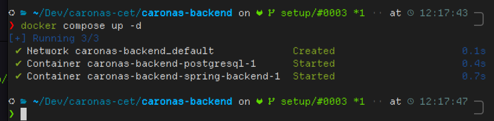
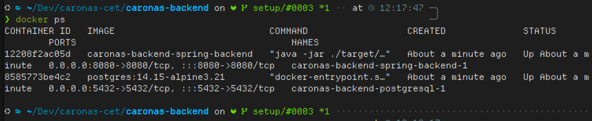
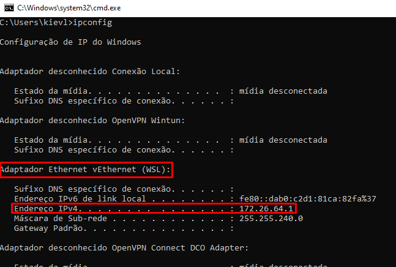
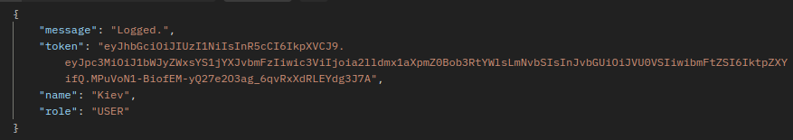

# Caronas UFRN
Aplicativo de caronas para estudantes da UFRN feito com Angular e Spring Boot (descontinuado).

# API Tutorial
Este tutorial tem o intuito de ensinar a rodar a API do Spring Boot localmente para ser usada de teste pelo frontend.

As rotas da API ainda não estão finalizadas. Elas serão construídas com base na demanda do frontend.

## Requisitos
- Docker
    - Instalação UBUNTU: [Docs Docker - Install UBUNTU](https://docs.docker.com/engine/install/ubuntu/)
    - Instalação Windows (Docker Desktop): [Docs Docker - Windows Install](https://docs.docker.com/desktop/setup/install/windows-install/)
- Git

## Deploy da API localmente

### **1° PASSO:**

Faça o clone do repositório do projeto (**SE VOCÊ JÁ TEM O REPOSITÓRIO, PULE PARA O PASSO 3**):

```bash
git clone https://github.com/KievL/caronas-ufrn.git
```

Este comando pode pedir seu login do github. 

Se você ainda não tiver permissão para acessar o repositório, peça no grupo do whats, enviando seu email do gitlab.

### **2° PASSO:**

Entre no diretório onde foi clonado o repositório e onde estão os arquivos do projeto até localizar o arquivo **docker-compose.yml.**

### **3° PASSO:**

Abra o terminal no diretório do projeto (**…/caronas-ufrn**).

### **4° PASSO:**

No terminal, dentro do diretório do projeto, execute:
```
docker compose up -d
```

Se ao final do comando aparecer algo parecido com:

então a instalação deu certo e o backend está rodando na sua máquina.

Para checar, rode o comando:

```bash
docker ps
```

E você deverá ver algo como:


## Como usar a API
### **No Linux ou Windows (sem WSL):**

Se você rodar o comando “*docker compose up”* diretamente do seu computador (sem WSL), o backend estará disponível em:
***http://0.0.0.0:8080/api/***

Para checar as rotas prontas, acesse a documentação do Swagger do backend abrindo em seu navegador o seguinte endereço:
***http://0.0.0.0:8080/api/documentation***

### **No Windows com WSL:**

Se você rodar o comando “*docker compose up”* dentro do WSL, você deve antes checar o IPV4 do seu WSL. No seu terminal do Windows (do WINDOWS, não do WSL), digite:

```
ipconfig
```

Procure pelo IPV4 do WSL.

A API ficará disponível nesse IP. No exemplo da imagem acima, pode-se acessar a API pelo IP:
***http://172.26.64.1:8080/api/***
E a documentação do projeto ficará disponível em:
***http://172.26.64.1:8080/api/documentation/*** .

## Como desligar a API
Para desligar a api, execute no terminal no diretório do projeto do backend:

```
docker compose down
```

## Como atualizar a API
Toda vez que uma atualização sair, execute o seguinte comando (no diretório do projeto) para atualizar o respositório local com as modificações:

```bash
git pull
```

Após isso, execute (atenção para o —build):

```bash
docker compose up -d --build
```

A nova versão da API será inicializada.

## Autenticação
Algumas rotas precisam de autenticação para sua requisição ser bem sucedida. Se você tentar fazer uma requisição sem o cabeçalho de autenticação para uma rota que precisa de autenticação, será retornado um erro com status 403 “Forbidden”.

Na documentação do projeto (***http://host:8080/api/documentation***), você pode checar as rotas que precisam de autenticação. Elas vão ter na descrição: *[REQUER AUTENTICAÇÃO BEARER].*

Para essas rotas que requerem autenticação, você deve adicionar no cabeçalho da requisição:

***“Authorization”: “Bearer <token>”***

O token é recebido toda vez que um login é realizado. No exemplo abaixo, podemos ver a resposta da requisição de um login. No caso, a string do token da resposta abaixo deve ser usada no lugar de ***<token>*** no cabeçalho acima.

